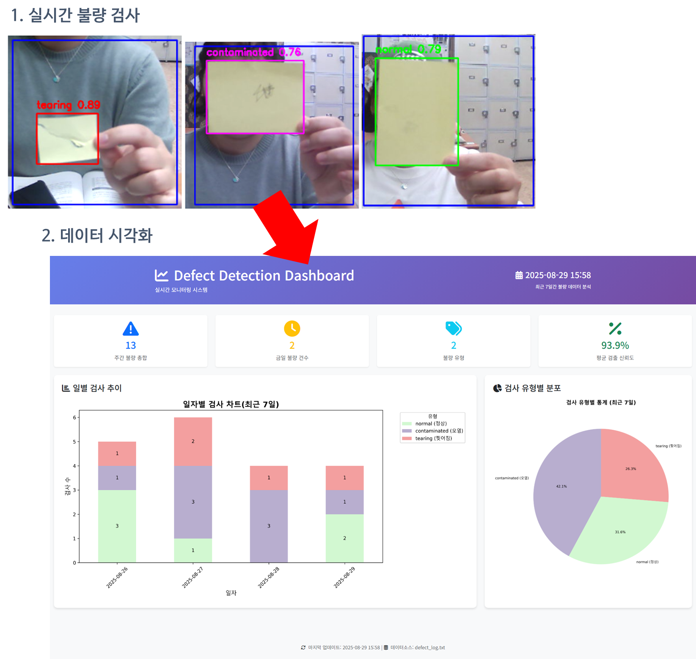
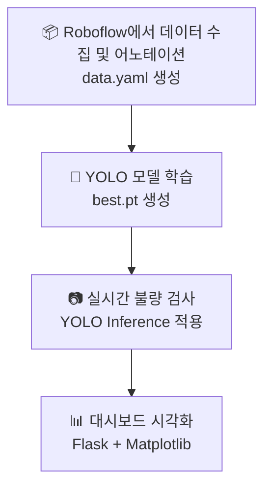

# 📌 스마트팩토리 제품 불량 검사 (YOLO 기반)
인공지능 영상 분석을 통한 생산라인 불량 검사 프로젝트

> 

## 0. 하드웨어
- 웹캠(FULL HD)
- 데스크탑

## 1. 프로젝트 개요

#### 1.1. 목표
- **생산 라인에서 발생하는 불량(오염, 찢어짐 등)을 YOLO 모델을 이용해 실시간으로 검출**
- 참고 : [가이드라인](https://docs.google.com/document/d/11St3DxbKel53c_lsmyGywFxLmrUMXbrFrW3sIzhtg8s/edit?tab=t.0)
- 지원하고자 하는 회사의 실제 제품을 분석하고, 발견한 문제점을 개선하는 실무형 프로젝트
- 완벽한 결과물보다는 실용적인 문제 해결 과정과 협업을 통한 학습에 집중

#### 1.2. 환경

| 항목    | 내용                                                           |
| ----- | ------------------------------------------------------------ |
| 언어    | Python                                                       |
| 플랫폼   | Windows                                                      |
| 라이브러리 | OpenCV, Tkinter, Flask, ultralytics (YOLOv8)                 |
| 데이터셋  | Roboflow에서 어노테이션한 `data.yaml` 기반, YOLOv8으로 재학습(`best.pt` 생성) |
| 모델    | `YOLOv8n-seg`                              |


---

## 2. 목차
**1. [제품 체험 및 문제 발견](/docs/01-problem-discovery.md)**

**2. [주요 기능](#4-주요-기능)**

**3. [프로그램 실행](#5-프로그램-실행)**

**4. [기술적 학습 성과](/docs/03-technical-learning-outcomes.md)**

---

## 3. 진행상황
- **[Daily log](/docs/02-daily-log.md)**
- **피드백**
    - [0814 피드백 진행](/feedback/0814.md)
        - [피드백을 기반으로 개선점찾기](/docs/01-problem-discovery.md)
    - [0818 피드백 진행](/feedback/0818.md)
    - [0820 피드백 진행](/feedback/feedback_form.md)

---

## 4. 주요 기능

#### 4.1. YOLO 모델 기반 불량 탐지
- 웹캠으로 촬영된 영상에서 ROI(관심 영역)를 지정
- YOLO 모델을 통해 객체(불량 유형) 검출
- 검출 결과에 따라 ROI 박스 및 라벨 색상 표시

#### 4.2. Tkinter 기반 UI
- 실시간 영상 스트리밍 출력
- 대시보드와 영상 화면을 연결하기 위해 Tkinter 안에서 openCV를 출력
- 상태 메시지(Label)를 통해 사용자 안내 (ex: 로그 저장 안내 등..)

#### 4.3. 로그 기록 기능
- 스페이스바(`space`)입력 시 현재 검출된 라벨을 `defect_log.txt`에 저장

#### 4.4. Flask 서버와 병렬 실행
- 애플리케이션 실행 시, Flask 웹 서버(`flask_app.py`)를 별도 프로세스로 실행

---

## 5. 프로그램 실행

#### 5.1 프로그램 동작 흐름


#### 5.2. 실시간 불량 검사
- 웹캠 연결 및 영상 입력
- YOLO 추론(Inference) 수행
- 결과(바운딩 박스, 라벨) 화면 표시
    > 


#### 5.3. 로그 저장
- 불량 검출 시 텍스트 로그(`defect_log.txt`) 기록
- 발생 시간, 불량 유형 저장
- 로그 기록시 안내 메세지 화면에 출력
    > 


#### 5.4. 대시보드 실행
- Flask 서버 실행
- 실시간 통계 데이터 전달
- Matplotlib 그래프(일별 추이, 유형별 분포) 시각화
  > 

- 불량 유형 데이터 확인
  > 


#### 5.5 실행방법
```bash
# 가상환경 생성
python -m venv minivenv

# 가상환경 실행
source minivenv/Scripts/activate

# pip 패키지 다운로드
# requirements.txt에 저장된 패키지 다운로드 명령어
pip install -r requirements.txt

# 프로그램 실행
python main.py
```


